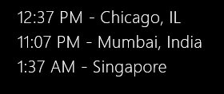

# rainmeterWorldclock

Simple world clock for Rainmeter, matching the "Do I need a Jacket" style

#### Instructions

1. [Download RMSKIN file](https://github.com/alystair/rainmeterWorldclock/raw/master/rainmeterWorldclock_1.rmskin), install.
2. Change Timezone and Format per [Clock#], copy/delete as necessary for more or less timezones